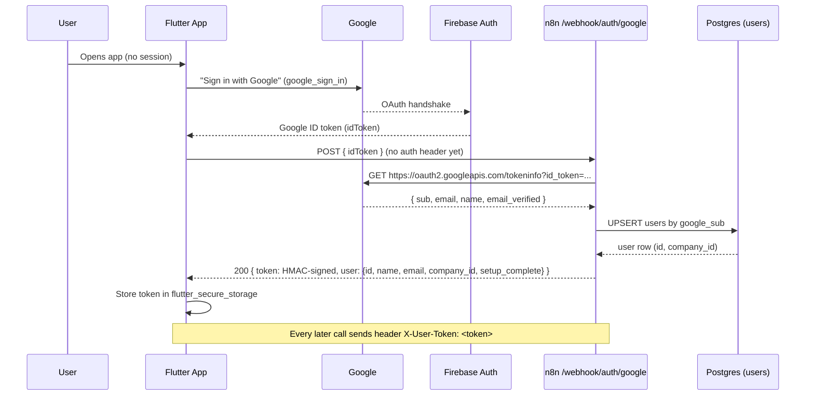
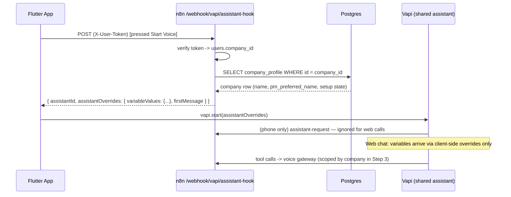
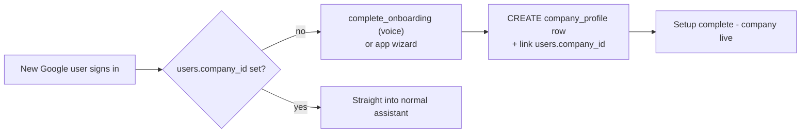

# Multi-Tenant Architecture — Construction PM Assistant (Play Store)

Status: ACTIVE PLAN (Step 1 approved and in implementation)
Decisions locked 2026-08-29 (user):
- The app + Vapi are two front doors (visual app, spoken voice). The login credential is
  the starting point of personalized data: identity -> company -> row scope.
- Auth method: Google sign-in (Firebase Auth — Firebase already in the app for FCM).
- User model v1: ONE user per company (the PM/owner). No crew accounts yet.
- ONE shared Vapi assistant serves every company (template prompt + per-call variable
  injection). No per-company assistants.

---

## 1. Mental Model

    LOGIN (Google)  -->  users row  -->  company_id  -->  every query scoped to that company
                                                      -->  hook injects that company's variables
                                                      -->  gateway tools read/write only that company

Everything that exists today (hook, variables, greeting, gateway, onboarding) is
single-tenant. It all keeps working; we add the identity layer in front of it.

---

## 2. Flow Diagrams

### 2.1 Authentication flow (Step 1 — ACCOUNTS)



### 2.2 Voice call flow (Step 1 hook behavior, Steps 2-3 scoping)



### 2.3 Per-company onboarding (Steps 2-3)



---

## 3. Target Database Schema

### 3.1 NEW table: users (Step 1 — implemented now)

```sql
CREATE TABLE users (
    id           UUID PRIMARY KEY DEFAULT uuid_generate_v4(),
    google_sub   VARCHAR(255) UNIQUE NOT NULL,   -- Google's stable subject id
    email        VARCHAR(255) UNIQUE NOT NULL,
    name         VARCHAR(255),
    company_id   SMALLINT REFERENCES company_profile(id) ON DELETE SET NULL,  -- NULL until onboarding
    created_at   TIMESTAMPTZ NOT NULL DEFAULT CURRENT_TIMESTAMP,
    last_login_at TIMESTAMPTZ
);
CREATE INDEX idx_users_company ON users (company_id);
```

- google_sub is the identity key (stable across email changes); email is display.
- company_id NULL until the user completes onboarding (creates their company).
- One row per person. One user per company in v1 (no invites/roles yet).
- Type note: company_profile.id is SMALLINT (migration 0007 pinned it to 1); company_id
  matches that type. Step 2 keeps this (max 32767 companies — ample). If we ever need
  UUID company ids, that is its own migration.

### 3.2 company_profile: single-row -> per-company (Step 2)

Drop the single-row constraint; keep everything else:

```sql
ALTER TABLE company_profile DROP CONSTRAINT company_profile_id_check;  -- id no longer pinned to 1
ALTER TABLE company_profile ADD COLUMN IF NOT EXISTS created_by_user UUID REFERENCES users(id);
```

- Existing row id=1 stays = the original Ireh Construction company (backfill target).
- New companies are INSERTed with a fresh id; users.company_id points at it.
- Briefing time, rates, branding: already per-row, now naturally per-company.

### 3.3 Every business table gains company_id (Step 2)

| Table                  | FK to                    | Notes |
|------------------------|--------------------------|-------|
| customers              | company_profile          | |
| projects               | company_profile          | company_id on projects only; children inherit via project_id |
| estimates              | (inherit via projects)   | no direct column needed |
| change_orders          | (inherit via projects)   | |
| invoices               | (inherit via projects)   | |
| invoice_line_items     | (inherit via invoices)   | |
| timesheets             | (inherit via projects)   | |
| workers                | company_profile          | direct column (workers are company-wide, not per-project) |
| payroll_runs           | company_profile          | |
| payroll_entries        | (inherit via payroll_runs) | |
| schedule_items         | company_profile          | project_id may be NULL (company-wide items) -> needs own column |
| device_tokens          | company_profile          | one device belongs to one company |
| users                  | company_profile          | 3.1 |

Migration mechanics (single migration, run after backfill is proven):

```sql
-- nullable first
ALTER TABLE customers ADD COLUMN company_id UUID REFERENCES company_profile(id);
-- ... same for projects, workers, payroll_runs, schedule_items, device_tokens ...
-- backfill everything to the original Ireh company
UPDATE customers SET company_id = '00000000-0000-0000-0000-000000000001';
-- (exact id: the existing company_profile row id, 1 :: uuid via the pinned row)
-- then enforce
ALTER TABLE ... ALTER COLUMN company_id SET NOT NULL;
```

Constraint changes required:
- workers.worker_code UNIQUE  ->  UNIQUE (company_id, worker_code)  (W-001 may repeat across companies)
- invoices.invoice_number UNIQUE -> UNIQUE (company_id, invoice_number)
- payroll_runs UNIQUE (period_start, period_end) -> UNIQUE (company_id, period_start, period_end)
- device_tokens UNIQUE (token) stays global (tokens are globally unique; ownership via company_id)
- customers.email UNIQUE -> UNIQUE (company_id, email)  (same customer email may appear in two companies)

### 3.4 Views and functions (Step 3)

- view_project_financial_summary: add company_id passthrough (projects.company_id) so the
  gateway can filter `WHERE company_id = $1`. View itself stays a view; scoping happens in
  the gateway query.
- view_schedule: add company_id to each UNION branch (schedule_items.company_id, projects.company_id,
  invoices.project->company, estimates.project->company).
- fn_run_payroll: take p_company_id uuid and join `WHERE cp.id = p_company_id` (replaces `cp.id = 1`).

---

## 4. API Contracts

### 4.1 POST /webhook/auth/google  (Step 1 — new)

Request:
```json
{ "idToken": "<google id token from google_sign_in>" }
```
NOTE: the token MUST be the raw Google-issued ID token. Do NOT send a
FirebaseAuth-reissued token — Firebase tokens are signed with Firebase's own
keys and the tokeninfo endpoint rejects them ("Invalid Value").
Response 200:
```json
{
  "token": "<HMAC session token>",
  "user": {
    "id": "uuid",
    "name": "Dave",
    "email": "dave@example.com",
    "company_id": null,
    "setup_complete": false
  }
}
```
Server behavior:
1. Verify idToken: GET https://oauth2.googleapis.com/tokeninfo?id_token=<idToken>
   - Require aud == Firebase Android client id AND email_verified == true.
   - (tokeninfo is keyless; good enough for v1. Hardening path: Firebase Admin SDK.)
2. UPSERT users by google_sub (update name/email/last_login_at on repeat sign-in).
3. Issue session token: HMAC-SHA256 over `user.id + "." + expires_at` with
   AUTH_TOKEN_SECRET (n8n env var), base64url, format `v1.<payload>.<sig>`.
4. Return token + user. setup_complete derived from company_id != NULL AND company_profile.setup_completed_at != NULL.

Errors: 401 invalid token, 400 malformed body. All responses JSON.

### 4.2 X-User-Token header (Steps 1-3)

Every authenticated call from the app carries:
```
X-User-Token: v1.<payload>.<sig>
```
Endpoints that honor it:
- POST /webhook/auth/me  (optional, Step 1: validate + return fresh user record)
- POST /webhook/vapi/assistant-hook  (Step 1: resolve user; fall back to single-tenant if absent)
- POST /webhook/device/register  (Step 1: tie device to user; fallback to single-tenant)
- POST /webhook/voice/gateway  (Step 3: scope every tool query by company_id)

Fallback rule (keeps old behavior while migrating): missing/invalid token -> act as the
legacy single-tenant user (company id=1). This is temporary and removed once the app is
login-gated.

### 4.3 Hook contract (unchanged, now per-company)

```json
{
  "assistantId": "67e2850c-1028-484d-bf52-d948826b2a7e",
  "assistantOverrides": {
    "variableValues": { "setup_complete": "...", "company_name": "...",
                        "pm_preferred_name": "...", "onboarding_steps": "..." },
    "firstMessage": "..."
  }
}
```

---

## 5. Security Notes

- Session tokens are HMAC-signed with AUTH_TOKEN_SECRET stored ONLY in the n8n compose
  env on the VPS. Never in the app, never in the repo, never in memory.
- Vapi stays keyed by company via call metadata in Step 3 (metadata.userId echoed on every
  server event) — the gateway resolves company server-side; the client never sends company_id.
- Google idToken is verified server-side; the app never sends anything forgeable.
- Play Store credential hygiene: debug keystore fingerprint (current signing) is fine for
  dev; before store release, switch to a real release keystore and re-register SHA-1/SHA-256
  in Firebase (see doc/MULTITENANT.md Step 1 notes).

---

## 6. Implementation Steps (tracked)

- [x] Step 0 — Onboarding wizard single-tenant (done, user-verified 2026-08-29)
- [ ] Step 1 — ACCOUNTS (backend DONE + verified 2026-08-30; app code DONE, pending Firebase console + APK test):
      db/0017 users table (LIVE); n8n /webhook/auth/google (LIVE, verified: 400/401 JSON errors, SQL upsert, HMAC
      round-trip); AUTH_TOKEN_SECRET (compose env); hook token resolution w/ single-tenant fallback (LIVE, verified
      with minted token); Flutter login screen + secure token storage + X-User-Token on hook/register (analyze
      clean); Firebase console TODO (user): enable Google provider, add SHA-1, refresh google-services.json.
- [x] Step 2 — TENANT COLUMNS (DONE + verified live 2026-09-04): db/0019 adds
      `company_id SMALLINT NOT NULL DEFAULT 1 REFERENCES company_profile(id)` to customers, projects,
      workers, payroll_runs, schedule_items, device_tokens, invoices. Implemented as NOT NULL DEFAULT 1
      (not nullable->backfill) — same invariants, zero gateway breakage: every pre-Step-3 write omits
      company_id and lands in company 1 (Ireh). company_profile.id is now sequence-driven
      (`company_profile_id_seq` START 2) and the id=1 CHECK is dropped; created_by_user added (nullable).
      Global uniques replaced by per-company unique INDEXES (uq_customers_company_email,
      uq_workers_company_worker_code, uq_invoices_company_invoice_number, uq_payroll_runs_company_period)
      — invoices needed its own company_id column (a unique cannot span a join). db/0020_tenant_verify.sql
      (self-rolling-back) proves in-company duplicates are rejected AND cross-company duplicates allowed.
      Bonus: voice-gateway `add_worker` was dead-on-arrival — `LPAD(int,3,'0')` is a plan-time type error
      (never exercised live) and it relied on the now-dropped global worker_code unique. Rewritten to
      `ON CONFLICT (company_id, worker_code)` with a `::text` LPAD arg; workflow redeployed (active).
      NOTE: 0013(a) "company_profile has exactly 1 row" assertion must be relaxed when Step 3 starts
      creating companies (0013/0020 live runs are clean today).
- [ ] Step 3 — SCOPED SERVICE: hook returns caller's company; gateway tools filter by
      company_id; complete_onboarding CREATES company_profile + links user; views/functions
      per 3.4; remove single-tenant fallback.
- [ ] Step 4 — STORE POLISH: real release keystore; runtime-config base URLs; app icon;
      privacy policy; Play Console listing.

## 7. Open Questions (for later steps)

- Crew/multiple users per company: revisit after v1 store launch (invites, roles).
- Account deletion / data export (Play Store policy requirement) — Step 4.
- Billing: subscriptions per company (Stripe) — after store launch.
